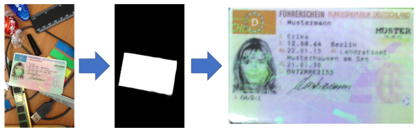

# ML_IDCard_Segmentation (Pytorch) - WIP
Machine Learning Project to identify an ID Card on an image.  

### Objectives
The goal of this project is to recognize a ID Card on a photo, cut it out using semantic segmentation and to 
transform the perspective so that you get a frontal view of the ID Card.

## Additional Information
Dataset: [MIDV-500](https://arxiv.org/abs/1807.05786)   
Pytorch Version: 1.7.1 CUDA 11.2

Trained on a NVIDIA GeForce RTX 3090

## Installation
1. Create and activate a new environment.
```
conda create -n idcard python=3.9.1
source activate idcard
```
2. Install Dependencies.
```
pip install -r requirements.txt
```

## Download and Prepare Dataset
Download the image files (image and ground_truth).  
Splits the data into training, test and validation data.
```
python prepare_dataset.py
```

### Training of the neural network
```
python train.py --resumeTraining=True
```
`resumeTraining` is optional an resumes training on an existing `./pretrained/model_checkpoint.pt`

### Test the trained model
```
python test.py test/sample1.png --output_mask=test/output_mask.png --output_prediction=test/output_pred.png --model=./pretrained/model_final.pt
```

Call `python test.py --help` for possible arguments. 

### Additional commands
Starts Tensorboard Visualisation.
```
tensorboard --logdir=logs/
```

## Background Information

### Model
A [U-NET](https://arxiv.org/abs/1505.04597) was used as the model.
U-Net is a convolutional neural network that was developed for biomedical image segmentation at the
Computer Science Department of the University of Freiburg, Germany.
The network is based on the fully convolutional networkand its architecture was modified and extended to work with
fewer training images and to yield more precise segmentations. 
Segmentation of a 512*512 image takes less than a second on a modern GPU.
  


### Metrics
The Metric [IoU](https://arxiv.org/abs/1902.09630) (Intersection over Unit / Jaccard-Coefficient) was used
to measure the quality of the model.
The closer the Jaccard coefficient is to 1, the greater the similarity of the quantities. The minimum value of the Jaccard coefficient is 0.   

  
Example:  


## Results for validation set (trained on the complete dataset)
Intersection over Unit:  
0.9939

Pipeline Example:  



